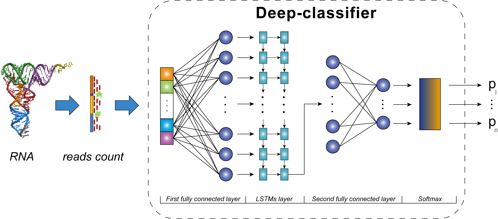

# `scDLC`

> a deep learning framework to classify large  sample single-cell RNA-seq data.

__Authors:__ Yan Zhou, Bin Yang, Tiejun Tong, Niansheng Tang

[](http://opensource.org/licenses/MIT)
---

## Description

`scDLC` is a deep learning classifier (scDLC) for large sample scRNA-seq data, based on the long short-term memory recurrent neural networks (LSTMs). This classifier does not require a prior knowledge on the scRNA-seq data distribution and it is a scale invariant method which does not require a normalization procedure for scRNA-seq data.



---

## Requirements

It is required to install the following dependencies in order to be able to run the code of scDLC

- [Anaconda3](https://www.anaconda.com/products/individual)  
- [R>=3.5.3](https://cran.r-project.org/)  
- [python 3](https://www.python.org/downloads/)  
  [sklearn](https://pypi.org/project/sklearn/0.0/)，[numpy 1.18.5](https://pypi.org/project/numpy/1.18.5/)，[pandas 1.1.0](https://pypi.org/project/pandas/1.1.0/)，[tensorflow 1.15.0](https://pypi.org/project/tensorflow/1.15.0/)，[rpy2 2.9.5](https://pypi.org/project/rpy2/2.9.5/)
  
  In order to enable rpy2 package to be successfully imported in python, you need to add the following variables to the environment variables.  
  
  Open the environment variable setting interface:
  ```
  computer-> property -> advanced and system setting -> environment variables
  ```
  In the user variable field, add the following R path to variables path:
  ```
  C:\Program Files\R\R-3.0.2\bin\x64 (my system is windows 64bit) 
  ```
  In the system variable field add two new variables:
  ```
  R_HOME C:\program files\r\r-3.0.2  
  R_USER C:\Users\"your user name"\Anaconda\Lib\site-packages\rpy2
  ```
  
---

## Usage

This GitHub repository contains the source code needed to build the `slapnap` docker image. The repository is also set up for continuous integration via Travis-CI, with built images found on [DockerHub](https://cloud.docker.com/u/slapnap/repository/docker/slapnap/slapnap). See the [Docker website](https://docs.docker.com/docker-for-windows/install/) for installation instructions.

From a terminal the image can be downloaded from DockerHub via the command line.

```{bash, eval = FALSE}
docker pull slapnap/slapnap
```

`slapnap` is executed using the docker run command. For example, the following code will instruct `slapnap` to create and evaluate a neutralization predictor for the bnAb combination VRC07-523-LS and PGT121:

```{bash, eval = FALSE}
docker run \
  -v path/to/local/save/directory:/home/output/ \
  -e nab="VRC07-523-LS;PGT121" \
  -e outcomes=”ic50;estsens” \
  -e combination_method="additive" \
  -e learners=”rf;lasso” \
  -e importance_grp=”marg” \
  -e importance_ind=”pred” \
  slapnap/slapnap:latest
```

The `–v` tag specifies the directory on the user’s computer where the report will be saved, and `path/to/local/save/directory` should be replaced with the desired target directory.  Options for the analysis are passed to the container via the `-e` tag; these options include the bnAbs to include in the analysis (`nab`), the neutralization outcomes of interest (`outcomes`), the method for predicting combination neutralization (`combination_method`), the learners to use in the analysis (`learners`), and the types of variable importance to compute (`importance_grp`, for groups of variables; `importance_ind`, for individual variables). Other output (e.g., the formatted analysis dataset and the fitted learners) can be requested via the `return` option. A full list of options and their syntax are available in the [`slapnap` documentation](https://benkeser.github.io/slapnap/3-sec-runningcontainer.html).

Complete documentation is available [here](https://benkeser.github.io/slapnap/).

## Issues

If you encounter any bugs or have any specific feature requests, please [file an
issue](https://github.com/benkeser/slapnap/issues).

---

